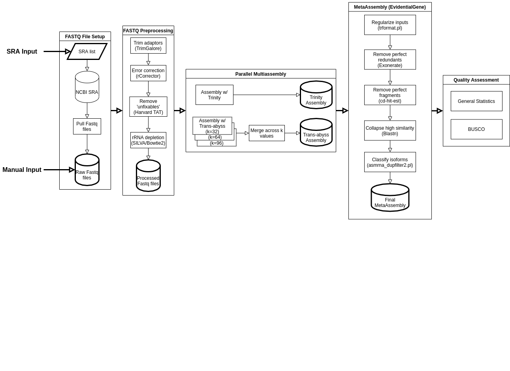

.. _examples:

Test Transcript Corral
-------------

See How it Works
''''''''''''''''''''''''''''

Transcript Corral uses Nextflow to efficiently handle all of the different intermediate files and commands for performing multiple-assembly including preprocessing, assembly, and BUSCO benchmarking.

Here is a flowchart that shows all of the different steps that the workflow automates:

Due to the complexities of assembly, it is not easy to simulate the entire process without using real data, which will usually take considerable time to complete.

We recommend trying out Transcript Corral using the provided Arabidopsis subsample or using single SRA sample.

.. note::

    For the examples on this page, Singularity will be used.  Singularity will automatically retrieve the latest Docker images and by default will store them in the ``work`` folder that Nextflow creates. However, Nextflow may warn that a cache directory is not set. If you intend to run this pipeline multipe times, you may wish to designate a permanent cache directory by seting the ``NXF_SINGULARITY_CACHEDIR`` prior to running GEMmaker. You can learn more at the `nf-core tools page <https://nf-co.re/tools/#singularity-cache-directory>`_

You can run the example by executing the following command within the GEMmaker directory:

.. code:: bash

   nextflow run systemsgenetics/transcript_corral -profile test,<docker/singularity/podman/shifter/charliecloud/conda/institute>

Replace the text `<docker/singularity/podman/shifter/charliecloud/conda/institute>` with the execution profile of your choice. For example to test GEMmaker in a Singularity image the command would be.

.. code:: bash

   nextflow run systemsgenetics/gemmaker -profile test,singularity

Results are stored in the ``results`` directory.

**About the Demo Test Data**

The demo sample file provided by Transcript Corral uses a single RNA-seq read from an Arabidopsis thaliana RNA-seq experiment. To reduce the runtime for this example dataset, the original reads have been downsamples to only include reads that map to the first chromosome.

Functional Test With Real Data
''''''''''''''''''''''''''''''
The demo data described above is provided to give a new potential user a very quick example for how to use this workflow. If you would like to try using GEMmaker with a real dataset we have included command-line examples in the step-by-step instructions for using RNA-seq data publicly available on the NCBI SRA archive.