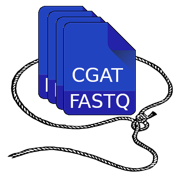

Welcome to TranscriptCorral's documentation!
====================================

TranscriptCorral is a `Nextflow <https://www.nextflow.io/>`_ workflow for large-scale de novo transcriptome assembly.

nf-core Compatibility
---------------------
TranscriptCorral is an `nf-core <https://nf-co.re/>`_ compatible workflow, however, TranscriptCorral is not an official nf-core workflow.

Acknowledgments
---------------
Development of TranscriptCorral was funded by the U.S. National Science Foundation Award `#1659300 <https://www.nsf.gov/awardsearch/showAward?AWD_ID=1659300&HistoricalAwards=false>`_.

.. toctree::
   :maxdepth: 2
   :caption: Contents:

   installation
   explore
   prepare_inputs
   execution
   results   
   troubleshooting
